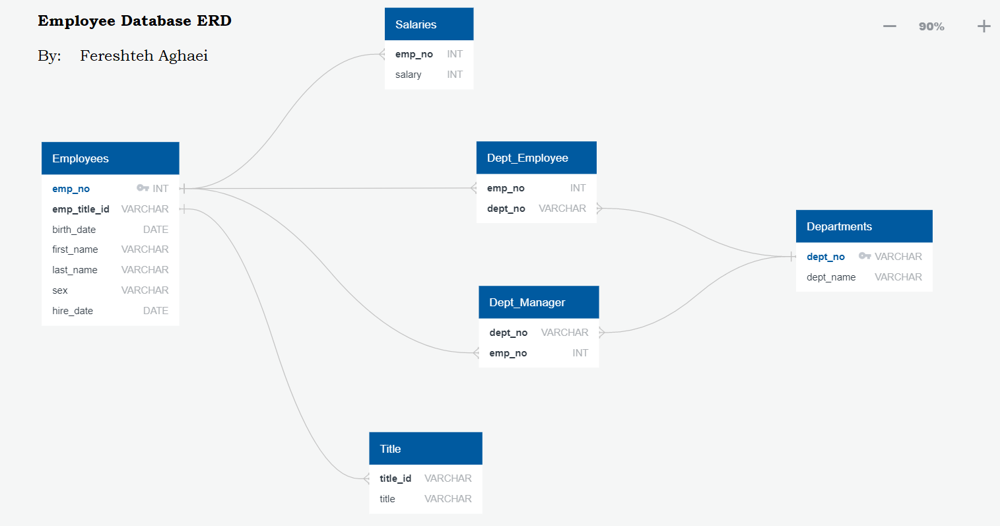

# Employee Database: A Mystery in Two Parts

Conduct a research project on employees of the corporation from the 1980s and 1990s. All that remain of the database of employees from that period are six CSV files.

Designing tables to hold data in the CSVs, importing the CSVs into a SQL database, answering questions about the data and  performing the following:

1. Data Modeling
2. Data Engineering
3. Data Analysis

### ----------------------------------------- DATA MODELING ------------------------------------------ 

Inspected the CSVs and sketch out an ERD (Entity Relationship Diagram)  of the tables using QuickDBD.

### --------------------------------------- DATA ENGINEERING ----------------------------------------

- Used the information to create a table schema for each of the six CSV files. Specified data types, primary keys, foreign keys, and other constraints.

- Created Tables in a correct order to handle foreign keys

- Imported each CSV file into the corresponding SQL table.

- Viewed each table to see imported data

  
  
  ##### -- Created Title Table 

----------------------------------
##### -- Created Employees Table 
#### 

----------------------------------
#### -- Created Departments Table 

----------------------------------
#### -- Created Dept_Employee Table 

----------------------------------
#### --Created Dept_Manager Table 

----------------------------------
#### -- Created Salaries Table 

## ---------------------------------- DATA ANALYSIS ----------------------------------

#### 								After completing database, analyzed the following:

1. Listed the details of each employee: employee number, last name, first name, sex, and salary.

   

   

2. Listed first name, last name, and hire date for employees who were hired in 1986.

   

   

3. Listed the manager of each department with the following information: 

   ​	department number, department name, the manager's employee number, last name, first name.

   

   

4. Listed the department of each employee with the following information: 

   ​	employee number, last name, first name, and department name.

   

   

5. Listed first name, last name, and sex for employees whose first name is "Hercules" and last names begin with "B."

   

6. Listed all employees in the Sales department: 

   ​	included their employee number, last name, first name, and department name.

   

   

7. Listed all employees in the Sales and Development departments: 

   ​	included their employee number, last name, first name, and department name.

   

   

8. In descending order, listed the frequency count of employee last names, to see how many employees share each last name.

## Data Visualization

##### Generated a visualization of the data by:

1. Importing the SQL database into Pandas, Merged Data and Created Group By for Average salary.

2. Created a histogram to visualize the most common salary ranges for employees.

   

   

3. Created a bar chart of average salary by title.

   

### Copyright

Fereshteh Aghaei © 2021. All Rights Reserved.